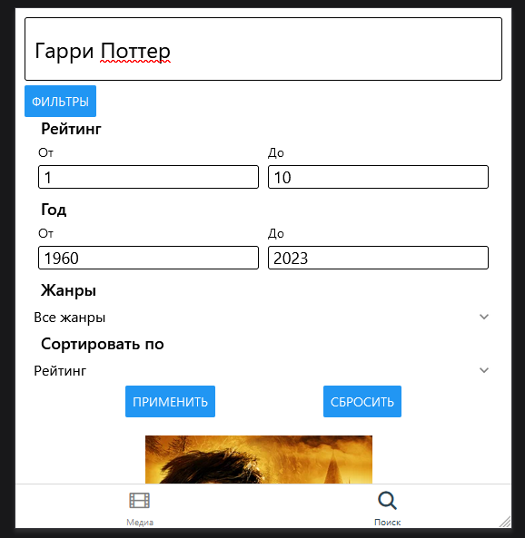
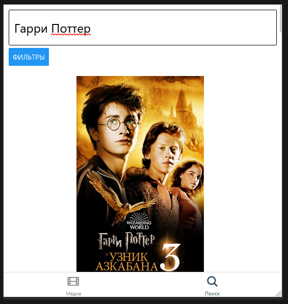
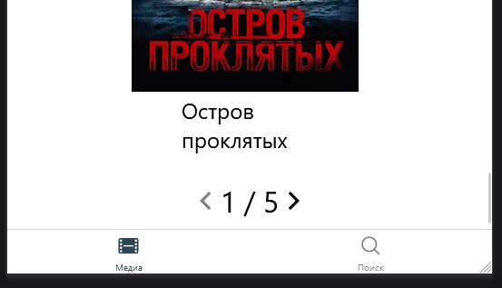

# React Native Project - MovietonNative

Product taking films info from api. Used **React Native** and **Redux**

View of [`Homepage`]

View of [`Search page`]

 

View of [`Film list (open by 'see all' button)`]

[`pagination`] realization

View of [`Film page:`]

 
